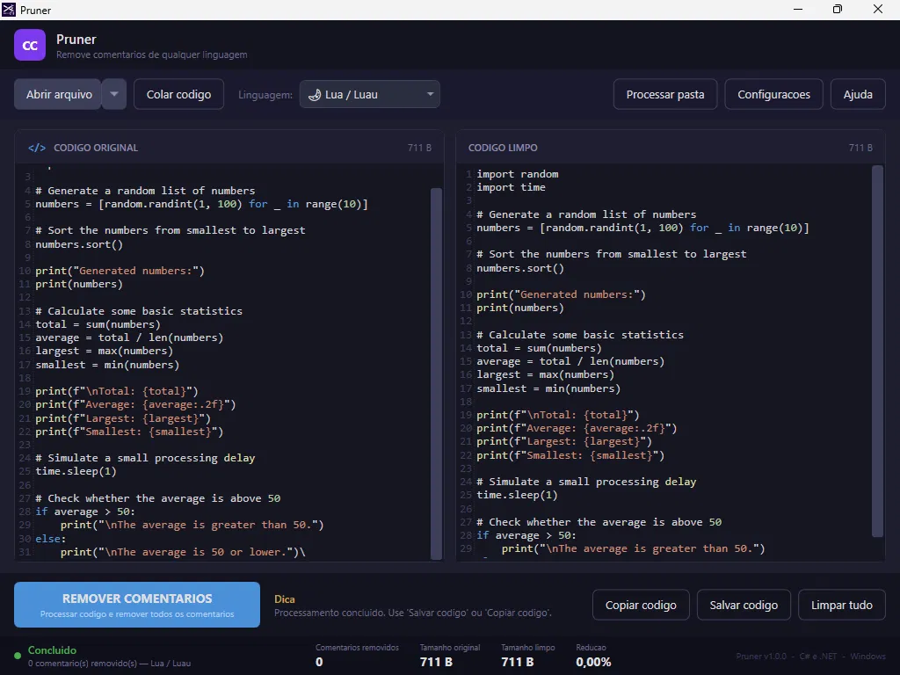

# Pruner

Comment stripper for 25 programming languages. Removes all comments from source code safely — without touching strings, logic, indentation, or anything else.

## Download

**[→ Download Pruner v1.0.0](https://github.com/noctaer/Pruner/releases/latest)**

Windows 10/11 x64. No dependencies required.

---



---

## What it does

AI-generated code tends to be verbose with comments — banners, separators, inline explanations, decorative blocks. Pruner strips all of them in a single pass, leaving only clean code.

**What Pruner is:** a comment stripper.  
**What Pruner is not:** a formatter, minifier, or obfuscator.

## Supported languages

Lua/Luau, Python, JavaScript, TypeScript, C#, SQL, Ruby, Go, Kotlin, Swift, Bash, Rust, HTML, CSS, PHP, Java, C, C++, Dart, PowerShell, Scala, R, Perl, Haskell, Elixir

## Features

- GUI with side-by-side diff and syntax highlighting
- Batch processing with optional overwrite mode
- CLI with glob, recursive, and dry-run support
- Drag and drop support
- Recent files history
- 192 automated tests

## CLI usage

```bash
pruner-cli file.cs
pruner-cli src/ --recursive
pruner-cli file.py --dry-run
pruner-cli file.js --lang javascript
```

## Architecture

```
Pruner.Core      — stripping logic, language detection
Pruner.IO        — file processing
Pruner.CLI       — command-line interface
Pruner.UI        — WPF desktop application
Pruner.Launcher  — lightweight launcher in Program Files
Tests            — 192 xUnit tests
```

## License

See [LICENSE](Installer/license.txt).

---

Made by [Nocta Studios](https://github.com/noctaer)
